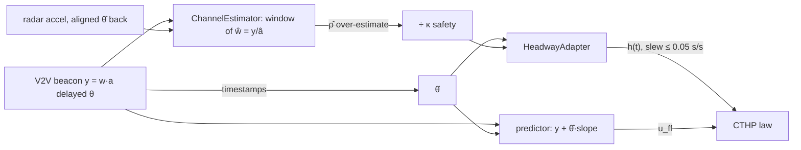

# D-016 — The novel extension: QoS-aware CACC (estimate → predict → adapt)

> **Summary box.** The project's research contribution: each follower
> *estimates* its own V2V link's noise level ρ̂ online from
> beacon-vs-radar residuals, *predicts* the delayed feedforward with a
> timestamp-based lead whose exact frequency-domain operator is evaluated
> by the same analysis code, and *adapts* its time headway h(t) with a
> rate-limited slew toward the **fixed-gain** stability requirement
> h_req(ρ̂/κ, θ̂). Chosen over three lighter novelty directions and one
> heavier one after an explicit option review with the project owner.
> Validated offline: the fixed-gain requirement lands on the paper's own
> case-A design point (0.945 s vs their 0.95 s at ρ = 5), the predictor
> holds h_req flat at 0.945 s for delays up to 0.3 s (7.18 s
> uncompensated), and the interference-zone experiment shows the adaptive
> platoon restoring ‖H̃‖∞ ≤ 0.99995 where the fixed design silently runs
> at 1.00224.

| field | value |
|---|---|
| **ID / title** | D-016 — QoS-aware CACC: joint estimation, prediction and headway adaptation |
| **Date** | 2026-07-07 (this expanded record: 2026-07-08) |
| **Status** | accepted; offline core validated; ROS 2 port specified in `10_Handoff_Plan.md` §3 |
| **Type** | research scope + architecture |
| **Depends on** | D-001 (base paper), D-003 (CTHP), D-004 (channel noise home), D-008 (delay binds), D-009 (worst noise end), D-010 (verdict discipline) |
| **Extended by** | D-017 (online gain re-tuning), D-018 (certification), D-019 (smoothing + staggered recovery) |
| **Evidence run** | `results/qos_adaptive/20260707-144337/metrics.json` (deterministic regeneration: `python scripts/qos_adaptive_study.py`) |
| **Pinned tests** | 11 core tests in `tests/test_qos_adaptive.py` (module now 17 with D-017/D-019; suite 58) |
| **Primary code** | `src/cacc/estimation.py`, `src/cacc/network.py` (schedule + predictor), `src/cacc/analysis.py` (predictor operator), `src/cacc/platoon.py` (outer loop) |

**Reading map.** §1–§2 for why this extension and not another; §3 for the
full alternatives analysis (the heart of this record); §5 for how the
pipeline actually works, component by component, with the math; §6 for
the evidence tables; §8 if you are operating or tuning it; §10 for the
questions everyone asks.

---

## 1. Context — where the project stood and what forced a decision

### 1.1 The state of the platform on 2026-07-07

By the morning of this decision the project had finished everything it
had originally promised, and the finished state is what made a *real*
extension both possible and necessary:

* **Exact reproduction of the base paper.** Ma, Pagilla & Darbha (2025,
  IEEE T-ITS; D-001) — minimum string-stable time headway under
  multiplicative n-bit V2V noise — reproduced to its printed digits:
  h_lb = 0.9375 s (case A, ρ = 5, ka = 0.5), ω-integral checks 0.3183,
  0.8727, all pinned as unit tests (D-007;
  `07_Base_Paper_Reproduction_Results.md`). This matters here because
  every extension claim inherits credibility from that anchor: the same
  code path that reproduces their numbers evaluates our modifications.
* **A deployment-gap study already done.** D-008 had swept feedforward
  delay and packet loss at fixed case-A gains and found the design
  tolerates only ~0.1–0.2 s of V2V latency before the required headway
  explodes, while packet loss up to 30 % barely moves it. So *latency*
  was known to be the binding deployment constraint, with real
  DSRC/C-V2X latencies uncomfortably close to the budget.
* **A distributed ROS 2 backend cross-validated against the offline
  core** (D-011…D-014): one process per vehicle, wall-clock-robust
  integration, per-hop agreement within a few percent. The platform
  could *run* anything we designed in a deployment-shaped environment.
* **Visualization** (D-015): rviz2 live 3D + MP4 renderer — a demo
  channel for whatever the extension produced.

### 1.2 The two directives that shaped the choice

The project owner gave two constraints that acted as the selection
pressure on the novelty direction:

1. *"More complex simulation, novel idea, Q1-worthy"* — the extension
   must be a **publishable research contribution**, not a parameter
   sweep. Q1-worthy concretely means: it must close a gap the base
   paper's own literature review leaves open, carry theory (not only
   simulation), and be falsifiable against numbers.
2. The product framing — **virtual validation that can replace hardware
   testbeds** (`docs/product/P-01`, P-02). This cuts the other way: the
   extension must be *deployment-shaped*. An idea that only works with
   oracle knowledge (true ρ handed to the controller, zero latency,
   pre-tuned gains per condition) fails the product test even if it
   makes a fine paper.

The tension between those two — publishable theory vs deployable
realism — is exactly what the chosen pipeline resolves: the *research
question is the deployment question* ("what does the running controller
need to know, and how does it learn it from what it can measure?").

### 1.3 The gap in the base paper, stated precisely

Ma 2025 answers: *given* a channel noise level ρ, what is the minimum
string-stable time headway h_lb(ka, ρ)? Three assumptions block using
that answer in an operating platoon:

| # | assumption in the paper | deployment reality |
|---|---|---|
| G1 | ρ is **known and constant** | V2V quality varies with distance, congestion, interference; nobody hands the controller ρ |
| G2 | gains (kp, kv) are **re-tuned per ρ** inside the eq.-29 feasible region | an operating platoon has fixed gains; re-tuning per condition is exactly what certification forbids without a safety argument |
| G3 | feedforward latency θ = 0 | D-008 measured the budget at ~0.1–0.2 s; DSRC/C-V2X deliver tens to hundreds of ms |

Each gap suggests a different sub-technology (estimation for G1,
adaptation for G2's *consequences*, prediction for G3), and the decision
below is fundamentally about **which subset to build and how they
compose**.

### 1.4 Timeline of the decision and build

* 2026-07-07 morning — options drafted, put to the owner via an explicit
  question (four directions, §3); owner selected the full pipeline
  ("Adaptive + delay compensation (both)").
* Same day — estimator + adapter + predictor built in
  `src/cacc/estimation.py` / `network.py` / `analysis.py`; the
  fixed-gain-requirement insight (§3.6.4, §5.4) emerged *during* the
  build when the adapter's first version (closed-form h_lb targets)
  produced targets that direct ‖H̃‖∞ checks contradicted.
* Same day — zone + delay experiments (`scripts/qos_adaptive_study.py`),
  11 pinned tests, doc `09_QoS_Adaptive_CACC.md`.
* 2026-07-07 evening — the two known limitations this record lists in §7
  were closed by follow-on decisions D-017 (gain re-tuning) and D-019
  (smoothing + staggered recovery); the pipeline was certified end-to-end
  by D-018. This record describes D-016 as decided, and marks every
  point later refined.

## 2. Problem statement, requirements, constraints

### 2.1 Problem statement

> Design and validate a control-relevant, receiver-side, online
> mechanism by which each follower of a CTHP platoon maintains L2 string
> stability **through time-varying V2V channel quality and nonzero
> feedforward latency**, without oracle knowledge (true ρ, true θ per
> message), without violating the quasi-static premises of the base
> paper's frozen-configuration stability theory, and while recovering
> headway (capacity) whenever the channel permits.

### 2.2 Requirements (as evaluated at decision time)

| ID | requirement | rationale | verified by |
|---|---|---|---|
| R1 | **Receiver-side quantities only**: beacons, radar, timestamps | product test (P-02): a real ECU has nothing else | architecture (§5.1); no oracle inputs in `estimation.py` |
| R2 | **Conservative under uncertainty**: estimation errors must fail toward *larger* headway | safety asymmetry: too much headway costs capacity, too little costs the stability margin | §5.2 bias analysis; `rho_safety` |
| R3 | **Theory in the loop**: the h target must come from the same frequency-domain machinery that reproduced the paper | D-010 discipline; reviewers must be able to check every claim | h_req from `min_stable_headway` bisection |
| R4 | **Per-hop decoupling preserved**: heterogeneous per-follower h admissible | one-vehicle look-ahead means hop i's transfer function depends only on follower i's h — adaptation must not break that | T-03/T-08; `platoon.py` per-follower `h_i` |
| R5 | **Quasi-static safety argument**: configuration changes slow relative to closed-loop dynamics | the paper's guarantee is for frozen configurations; we must stay near the frozen family | 0.05 s/s slew; T-08 |
| R6 | **Deterministic and seedable**: identical reruns, stage-consistent noise | platform invariant (D-004); certification (later D-018) depends on it | ρ-independent bit cache (§5.6) |
| R7 | **Distributable**: every signal used must exist in the ROS backend (stamps, radar history, beacon values) | Workstream A port must be a translation, not a redesign | `10_Handoff_Plan.md` §3 A3 |
| R8 | **Capacity recovery**: in good channel phases, h returns near the design value | the economic argument for adaptivity (vs designing for worst case permanently) | zone experiment good-phase h = 0.951–0.957 s |

### 2.3 Constraints

| ID | constraint | source |
|---|---|---|
| C1 | Control law stays the paper's CTHP law; gains fixed at case A *(this constraint is the deliberate scope cut of D-016; lifted later — with its own safety rule — by D-017)* | comparability with the base paper; G2 is studied, not assumed away |
| C2 | Channel model stays the paper's n-bit multiplicative noise with strictly bounded support | w ∈ [1−1/ρ, 1+1/ρ); D-004 |
| C3 | Continuous-link mode only (no sampled mode) for adaptive runs | the delay-line + estimator pairing assumes a continuous received signal; enforced with an explicit `ValueError` |
| C4 | Code files < 500 lines; everything unit-testable offline | repo rules |
| C5 | No new dependencies (numpy/scipy/matplotlib/yaml stack as-is) | environment stability (RB-01) |

### 2.4 Acceptance criteria fixed before building

1. The fixed-gain requirement curve must pass through the paper's own
   design point at the design channel quality (sanity anchor).
2. In a scheduled interference zone (ρ 10 → 3 → 10) the adaptive platoon
   must hold the in-force ‖H̃‖∞ ≤ 1 while a fixed h = 0.95 platoon
   demonstrably loses the margin, and must return to h ≈ 0.95 after.
3. With θ = 0.15 s and ρ = 5, the predictor must restore the
   frequency-domain verdict the uncompensated design loses.
4. Estimator: track ρ changes within seconds on entry (safety
   direction), tolerate ~20 s recovery on exit; never *under*-estimate
   the noise (i.e., never report the channel better than the safe bound).
5. Every one of the above pinned as a unit test or a metrics.json entry.

All five were met; see §6.

## 3. Options considered

The decisive question was put to the project owner with four strategic
directions. This section records each one with the depth the choice
deserved — including the two *internal* families of alternatives
(§3.6) that were decided without a user prompt because one option was
technically dominant.

### 3.1 Option A — channel-adaptive headway only (estimate ρ̂ → adapt h)

**Mechanism here.** Build `ChannelEstimator` + `HeadwayAdapter` exactly
as §5 describes, but no predictor; the feedforward is used as received.
Delay would be either ignored (θ = 0 scenarios only) or absorbed by
inflating the h_req table at the measured θ̂.

**What it buys.**
* Directly closes G1, the most cited gap (unknown channel quality).
* Smallest surface area: one new module, no touching of
  `analysis.gamma`.
* The capacity story (run h = 0.95 when good, pay more only in zones) is
  already available.

**What it costs / risks.**
* Leaves G3 wide open, and D-008 had *already measured* that delay is
  the binding constraint. Quantitatively, absorbing delay through the
  h_req table alone is brutal: at ρ = 5, h_req goes 0.945 → 1.133 →
  1.888 → 3.080 → 7.181 s for θ = 0 → 0.10 → 0.15 → 0.20 → 0.30 s
  (metrics `theory.h_req_theta_rho5`). At a plausible θ = 0.15 s the
  platoon would permanently pay **2× headway** — the capacity argument
  that motivates adaptivity dies.
* The noise × delay interaction (§6.4) means the delay penalty grows
  *with* noise — precisely in the zones where the adapter is already
  paying.

**Evidence.** The θ-sweep above; D-008's budget measurement.

**Failure modes.** None novel — it is a strict subset of the chosen
option.

**Kill reason.** It solves the second-most-binding gap while leaving
the most-binding one (measured, not assumed) untouched; the resulting
platform would certify designs to a latency assumption nobody can meet.

**Would win when:** the link is effectively zero-latency (wired test
benches, sub-10 ms fiber links between rig nodes) — then the predictor
is dead weight and this option is the right minimal system.

### 3.2 Option B — delay compensation only (timestamp predictor)

**Mechanism here.** Implement `V2VLink.receive_predicted` + the exact
predictor operator in `analysis.gamma` (as §5.5), run at fixed h chosen
for the *assumed* ρ.

**What it buys.**
* Closes G3 spectacularly (the flatline result, §6.2 — which we only
  *knew* after building; at decision time the expectation was "should
  restore most of the budget").
* No estimator, no adaptation machinery, no probing dither — the
  simplest credible novelty.

**What it costs / risks.**
* Assumes G1 away: ρ must be known and constant to pick h. The zone
  experiment later demonstrated exactly what that costs: the fixed
  h = 0.95 platoon inside a ρ = 3 zone runs at in-force ‖H̃‖∞ =
  **1.00224** (`zone_experiment.fixed-good.zone.hinf_worst`) — silently
  string-unstable, no alarm, while time-domain traces look almost
  normal for minutes (D-010: near-boundary growth is slow by nature).
  "Silently" is the product killer: a certification platform whose
  baseline behavior hides margin loss is worse than none.
* A predictor without an estimator also has no θ̂ *consumer* discipline:
  nothing else cross-checks the timestamps.

**Kill reason.** Fails the deployment-shaped test (G1) and specifically
fails it in the *dangerous* direction (silent margin loss), which the
product framing cannot tolerate.

**Would win when:** channel statistics are genuinely stationary and
characterized offline (e.g., a fixed test track with surveyed RF), and
only latency varies.

### 3.3 Option C — event-triggered beaconing

**Mechanism here.** Followers transmit only when the commanded/realized
acceleration changes by more than a threshold δ; the receiver holds the
last value; h adapts to the *effective beacon rate* (a proxy for
information quality). This was the third item on the original novelty
menu.

**What it buys.**
* A genuinely fashionable topic (bandwidth-constrained V2V, DSRC channel
  congestion) with a clean tradeoff curve to publish
  (bandwidth vs h_req).
* Complements any of the other options later.

**What it costs / risks.**
* **It changes the plant, not just the controller.** With send-on-delta,
  the sampling process becomes *state-dependent* (a nonlinear,
  trajectory-dependent operator between predecessor and follower). The
  paper's analysis — and our entire verdict discipline (D-010, R3) —
  lives on LTI transfer functions with deterministic noise intervals.
  There is no exact ‖H̃‖∞ for a send-on-delta link; we would be reduced
  to Monte-Carlo time-domain claims, the exact thing D-010 warns is
  uninformative near the boundary (the A/B contrast there is ≲ 0.4 %
  per hop).
* New theory (input-to-state or event-separation bounds) would be needed
  for a Q1-defensible claim — weeks, not hours, and disconnected from
  the base paper's framework (a different paper's premise, really).
* The existing sampled-link mode (msg_rate) already covers the
  *periodic* end of the bandwidth question — a 10 Hz beacon is a
  deterministic sampling operator we can and do analyze; send-on-delta
  is specifically the part that leaves LTI territory. So the marginal
  novelty of Option C over what the platform already has is exactly the
  part that breaks the platform's strongest property.

**Kill reason.** Incompatible with theory-in-the-loop (R3) inside this
project's framework and timeline; would demote the platform's strongest
property (exact frequency-domain verdicts beside every run) exactly
where reviewers look hardest.

**Would win when:** pursued *as a follow-on* with its own theory budget
— it stays on the roadmap (`product/P-03` item 6) and none of the
pipeline built here obstructs it (the estimator actually *helps*: ρ̂
and beacon-rate would feed one combined quality signal).

### 3.4 Option D — the full pipeline (chosen): estimate + predict + adapt

**Mechanism.** §5 in full: per-link `ChannelEstimator` (quantile
inversion of the bounded-support residuals), timestamp-based
feedforward predictor with an exact analyzable operator, and
`HeadwayAdapter` slewing h toward the fixed-gain requirement
h_req(ρ̂/κ, θ̂) from a bisection table.

**What it buys.**
* Closes G1 and G3 *and* honestly characterizes G2 instead of hiding it:
  the adapter deliberately targets the **fixed-gain** requirement, so
  the fixed-vs-retuned divergence (the ρ* ≈ 1.8 wall, §6.1) is a
  *finding of this decision*, not an oversight — and it is exactly the
  finding that motivated D-017 as a separately-argued layer.
* The three components validate each other: θ̂ from timestamps feeds
  both the estimator's radar alignment and the predictor; ρ̂ gates how
  much the predictor's noise amplification matters; the adapter turns
  both into one safety-relevant actuator (h).
* Every piece keeps R3: the predictor has an exact operator; the
  adapter's targets come from the reproduction-validated bisection.

**What it costs / risks (accepted with eyes open).**
* The most moving parts of any option — mitigated by strict receiver-side
  interfaces and 11 pinned tests.
* Needs persistent excitation (the probing dither, §5.3) — an honest
  limitation carried in every doc since.
* Transition dynamics (h ramps) create commanded waves — understood at
  decision time, quantified in the zone experiment, *fixed* later by
  D-019's staggering.

**Why it won.** It is the only option that answers the deployment
question end-to-end ("what does the running controller need, and how
does it learn it?"), keeps the exact-theory discipline, and turns the
remaining gap (G2) into a measured boundary rather than an assumption.
The owner picked it explicitly when offered all four.

### 3.5 Option E — adapt the *gains* instead of the headway (day-1 joint re-tuning)

Considered internally before the menu went to the owner: skip h
adaptation, instead move (kp, kv) with ρ̂ inside the paper's feasible
region (what D-017 later did as an *additional* layer).

**Kill reason at the time (deliberate deferral, not rejection).**
* Headway has monotone safety semantics — more h is always at least as
  string-stable at fixed gains (the ‖H̃‖∞(h) boundary in our region is
  one-sided; T-03), so a conservative estimator maps to a conservative
  actuator. Gains have no such monotone safety direction: a wrong kv
  can destabilize in *both* directions, so gain adaptation needs a
  stronger argument (which D-017 later supplied: targets pinned to the
  h-independent eq.-28a ceiling with its own slew limit).
* The *fixed-gain* requirement is itself the deployment question (G2):
  building h-only first measures the wall (ρ* ≈ 1.8, the
  5.28 s-vs-1.71 s divergence at ρ = 2) that justifies gain re-tuning
  with numbers instead of hand-waving.
* Certification story: h-only keeps the platoon inside the *paper's
  own* guaranteed family; day-1 gain scheduling would have coupled the
  novel estimator to a novel control family in one step — two unproven
  layers stacked.

**Re-match condition (met!):** once the h-only wall was measured and the
quasi-static argument matured (T-08), gain re-tuning was adopted as
D-017 — reusing this decision's estimator and slewing machinery
unchanged. The deferral order (h first, gains second) is why both
layers have clean evidence.

### 3.6 Component-level alternatives (decided inside D-016)

Four sub-decisions had their own live alternatives. They were resolved
on technical dominance, documented here to the same standard.

#### 3.6.1 Estimator statistic: quantile inversion vs the alternatives

The estimation target: the channel delivers y = w·a(t−θ) with w drawn
per hold-interval from the paper's n-bit lattice on
[1 − 1/ρ, 1 + 1/ρ); the receiver reconstructs ŵ = y / â by pairing the
beacon with the radar-measured predecessor acceleration aligned θ̂ into
the past. Estimate ρ from a window of ŵ samples.

| candidate | mechanism | why not (or why) |
|---|---|---|
| **moment matching** | Var(w) known function of ρ for the uniform lattice → invert sample variance | needs the *distribution* inside the support to be exactly the paper's uniform lattice; radar noise and pairing error inflate variance → **under-estimates ρ = reports the channel worse**… which sounds safe but is the wrong kind of safe: it converges slowly (O(1/√N) in variance) and the bias depends on nuisance parameters we can't verify online |
| **max-deviation inversion** | ρ̂ = 1 / max‖ŵ−1‖ over the window | maximally efficient use of the bounded support, but a *single* outlier pair (radar glitch, one mis-aligned sample at a maneuver edge) collapses ρ̂ to garbage for a whole window; zero robustness |
| **0.99-quantile inversion (chosen)** | ρ̂ = 1 / quantile₀.₉₉(‖ŵ−1‖) | keeps ~the max's efficiency on bounded support (the top of the sample always sits near the support edge when N ≳ 100) while tolerating ~1 % contaminated pairs; the residual bias direction is *known by construction* (§5.2) and handled by κ |
| **Bayesian posterior on ρ** | particle/grid posterior over ρ given the lattice likelihood | strictly more information, but opaque to certify (the verdict would depend on a prior), heavier per-tick, and its advantage vanishes when the support bound is the dominant information — which it is here |

**The decisive structural fact:** the support is *strictly* bounded, so
any high quantile of ‖ŵ−1‖ **under-estimates 1/ρ**, i.e. *over*-estimates
ρ — the estimator systematically believes the channel is *better* than
it is. That known bias direction is then flipped once, explicitly, by
the safety divisor κ = `rho_safety` (§5.2). Moment methods have
data-dependent bias directions; the quantile's is a theorem. That is
why it was chosen: **certifiable bias beats smaller-but-unsigned bias.**

#### 3.6.2 Sample-window policy: count-based vs age-based expiry

First implementation used the deque's count window alone (256 samples).
Measured failure (same day): after a zone exits, weak excitation means
few new samples; ρ̂ stayed stuck at ~3.1 for the better part of a
minute after the channel had returned to ρ = 10 — the platoon paid zone
headway on a clean channel. Fix: **age-based expiry** (`max_age_s`,
20 s) before every estimate; the count window remains only as a memory
bound. The asymmetry is deliberate and safe: entry detection is fast
(new large deviations dominate the 0.99-quantile within ~1 s at 25 Hz),
exit recovery waits for the bad samples to age out (~20 s) — slow only
in the *conservative* direction. Alternatives (exponential forgetting,
sliding-window quantile with per-sample weights) add tuning parameters
without changing that asymmetry, and exact expiry is trivially
explainable in a certification review.

#### 3.6.3 Excitation: probing dither vs waiting for maneuvers vs injecting into the estimator

The channel is unobservable when the communicated acceleration is ~0
(cruise): ŵ = y/â is undefined at â = 0 and hopeless below radar noise.
Three ways out were considered:

* **Wait for natural maneuvers** — unbounded detection latency in
  cruise; a zone entered during steady cruise would go unnoticed until
  the next brake — the worst possible moment to discover it. Rejected.
* **Estimator-side tricks** (estimate from beacon noise floor alone) —
  the multiplicative model gives *no* information at zero signal;
  mathematically dead. Rejected.
* **Leader probing dither (chosen)** — ±0.08 m/s² two-tone multi-sine
  (0.31 Hz and 0.73 Hz, incommensurate so the product signal never
  repeats exactly and both estimator gates and spectra stay busy),
  superposed by `_with_probe` (`src/cacc/platoon.py:354`). Cost, honest:
  ~1 cm/s velocity ripple, imperceptible in comfort terms (< 0.01 g),
  and a disclosed scenario ingredient — persistent excitation is the
  standard price of adaptive control and we say so in every relevant
  doc rather than hiding the dither in "sensor noise".

#### 3.6.4 Adaptation target: closed-form h_lb vs fixed-gain bisection (the insight of D-016)

The first adapter version targeted the paper's closed form
h_lb(ka, ρ) (eq. 17). Direct in-force ‖H̃‖∞ spot-checks (R3 discipline)
contradicted it: at ρ = 3 the platoon at h = margin + h_lb(0.5, 3) =
1.28 s was still slightly *unstable* (‖H̃‖∞ > 1). Investigation
produced the decision's central insight:

> **eq. 17 presumes (kp, kv) re-tuned inside the eq.-29 feasible region
> for each ρ.** An operating platoon has *fixed* gains. The case-A
> kv = 0.63 leaves the feasible region below ρ ≈ 3 entirely — the
> closed form answers a question the deployed system is not asking.

So the adapter targets the **fixed-gain requirement**: bisection on the
exact ‖H̃‖∞ (via `min_stable_headway`), worst case over both ends of
the noise interval, tabulated over (ρ, θ) grids and interpolated
(§5.4). The comparison in §6.1 (0.945 vs 0.9375 at ρ = 5; 5.28 vs
1.71 at ρ = 2) *is* this sub-decision's evidence: near the design point
the two agree (validation), far from it they diverge violently (the
finding). Alternatives:

* keep closed form + fudge factor — unfalsifiable, hides the wall;
* online bisection per tick — exact but ~10⁴× the compute for identical
  results vs a precomputed table (the table is seeded by the same
  function anyway);
* **table + bilinear interpolation (chosen)** — one-time cost at
  construction (shared across all followers of a platoon,
  `table=first._table`), exact at grid nodes, conservative-enough
  between them (grid chosen dense where the map is steep: ρ grid
  {1.5, 2, 2.5, 3, 4, 5, 7, 10, 15, 25, 50}).

Two implementation traps met and fixed (both now pinned by tests):
infeasible cells returned ∞, and NumPy's bilinear blend of a finite and
an infinite cell produced 0·∞ = NaN — cells are capped at 10.0 s
(`estimation.py:162`) with `update()` saturating at `h_max` (the
adapter's honest best effort); and the ρ grid must be clipped before
`searchsorted` or edge estimates index out of range.

#### 3.6.5 Predictor form: block-average slope vs raw derivative vs model-based lead

Detailed derivation in §5.5 and T-06; the alternative-analysis kernel:

| candidate | kill reason |
|---|---|
| raw two-sample derivative ŷ′ = (y(t) − y(t−Δ))/Δ | the received signal carries multiplicative noise re-drawn at 100 Hz; differentiating it amplifies noise by 1/Δ — at Δ = 10 ms the noise slope exceeds any plausible signal slope by orders of magnitude; unusable, verified immediately in a scratch run |
| Kalman/observer lead (model-based) | needs a predecessor *maneuver model* (jerk process) — a new modeling assumption the paper doesn't have, plus filter tuning that would vary by scenario; also opaque to exact frequency-domain analysis (time-varying gains) |
| Smith-predictor structure around the local loop | compensates *plant-input* delay; our delay is on the *feedforward external signal* — structurally the wrong tool (there is no inner loop to wrap) |
| **two-block averaged slope (chosen)** | slope from two adjacent T/2 = 0.2 s block averages of the *received* signal: averaging crushes the re-drawn multiplicative noise (≈ √(T/2·f_noise) ≈ √20 suppression per block), the lead has the **exact LTI operator** P(s) = 1 + θ̂·A(s)(1 − e^{−sT/2})/(T/2) that `analysis.gamma(pred_theta_hat=…)` evaluates on the imaginary axis — theory and simulation share one operator (R3), and the residual cost (mild noise amplification through the slope term) is *visible in the verdict* rather than hidden |

## 4. The decision

1. Build the full pipeline (Option D): per-link online channel
   estimation (quantile inversion with safety divisor κ), timestamp
   feedforward prediction (block-average slope, exact operator in the
   analysis), and rate-limited headway adaptation toward the
   **fixed-gain** requirement h_req(ρ̂/κ, θ̂) from a shared bisection
   table.
2. Keep gains fixed (case A) *within this decision*; measure and
   publish the fixed-gain wall as a finding; defer gain re-tuning to a
   separately-argued decision (→ D-017).
3. Scope guards: CTHP + continuous link only (explicit `ValueError`s);
   per-follower h; leader probing dither declared in scenarios;
   everything deterministic under the platform seed discipline.
4. Non-goals: event-triggered beaconing (roadmap), formal dwell-time
   proof (T-08 sketches the route; journal upgrade), cut-in/lateral
   scenarios (V-04 #1).

## 5. Design as implemented

### 5.1 Architecture (all receiver-side)

```
                     the follower i receiver
 ┌───────────────────────────────────────────────────────────────────┐
 │  V2V beacon y(t) = w·a_{i-1}(t−θ)      radar â_{i-1}(t) (clean)   │
 │        │  stamps → θ̂ = t_now − t_msg        │                     │
 │        │                                    │ look up θ̂ into      │
 │        ▼                                    ▼ the past            │
 │  ┌───────────┐    ŵ = y/â_delayed   ┌──────────────────┐          │
 │  │ predictor │◄──────────┐          │ ChannelEstimator │          │
 │  │ y+θ̂·slope │           │          │  window of |ŵ−1| │          │
 │  └─────┬─────┘           │          └────────┬─────────┘          │
 │        │ u_ff            │              ρ̂ (over-estimate)         │
 │        ▼                 │                   ▼ ÷ κ (flip bias)    │
 │  ┌───────────┐           │          ┌──────────────────┐          │
 │  │ CTHP law  │◄──────────┼──────────│  HeadwayAdapter  │          │
 │  │ kp,kv,ka  │   h(t)    │          │ slew → margin +  │          │
 │  └───────────┘           │          │ h_req(ρ̂/κ, θ̂)   │          │
 │                          └──────────┴──────────────────┘          │
 └───────────────────────────────────────────────────────────────────┘
```



Everything in the diagram exists in the ROS message set too (stamps,
radar topic, beacon topic) — requirement R7; the port is a translation
(`10_Handoff_Plan.md` §3 A3).

### 5.2 The estimator and its bias ledger

Sample formation (`ChannelEstimator.add_sample`,
`src/cacc/estimation.py:76`): a pair (y, â) is accepted only if
`|â| ≥ a_min` (0.03 m/s² — below that, radar noise dominates the ratio)
and the resulting ŵ lies in (0.2, 1.8) (impossible for any ρ > 1.25 —
a cheap physical-plausibility gate against mis-paired samples at
maneuver edges). Accepted pairs enter the window as (t, |ŵ − 1|).

Estimate (`rho_hat(t)`, `estimation.py:91`): expire samples older than
`max_age_s`; require ≥ 25 fresh samples; invert the 0.99-quantile;
clip to [ρ_min, ρ_max] = [1.5, 50].

The **bias ledger** — every distortion with its direction:

| effect | direction on ρ̂ | handled by |
|---|---|---|
| quantile below the support max | over-estimates ρ (channel looks better) | κ divisor |
| finite window (N ≈ 256) not reaching the support edge | over-estimates ρ | κ divisor |
| radar noise inflating \|ŵ−1\| | *under*-estimates ρ (safe direction) | accepted |
| pairing misalignment at maneuver edges | under-estimates ρ | plausibility gate + a_min |
| clock skew in θ̂ (ROS) | under-estimates ρ | acceptance bands widened in the ROS port (risk register) |

Net: distortions that make the channel look *worse* are accepted as
conservative; the two that make it look *better* are both artifacts of
the same statistic and are covered together by one explicit constant
κ = `rho_safety` (1.2 default; 1.15 in the zone scenario after the
feasibility-edge retune — see §8.2). Measured calibration (§6.3): raw
medians 10.4 / 3.14 / 10.7 against true 10 / 3 / 10 — over-estimation
of 4–5 %, comfortably inside κ.

**How large is the optimistic bias, from first principles?** Under the
paper's channel, w is drawn from a uniform 16-bit lattice on
[1 − 1/ρ, 1 + 1/ρ), so the folded deviation |w − 1| is (to lattice
resolution) uniform on [0, 1/ρ] with CDF F(x) = ρx. Then:

* The *population* 0.99-quantile is 0.99/ρ, so even with infinitely
  many clean samples, ρ̂ = 1/quantile → ρ/0.99 ≈ **1.0101·ρ**: a
  built-in +1 % optimism floor from the quantile choice itself.
* With N effective samples, the empirical quantile concentrates around
  F⁻¹(q·N/(N+1)) with sampling standard deviation
  ≈ √(q(1−q)/N)/f(F⁻¹(q)) = √(q(1−q)/N)·(1/ρ); at N = 256 that is
  ±0.62 %/ρ on the deviation scale, i.e. **ρ̂ fluctuates roughly ±1 %**
  (1σ) around its mean — small, but it is exactly this fluctuation that
  the steep h_req map amplifies into headway chatter (→ D-019).
* Samples are not fully independent: the noise factor is *held* for
  10 ms intervals (noise_rate = 100 Hz) while the estimator samples at
  25 Hz — adjacent samples can share a hold interval, shrinking the
  effective N by up to ~2×; and the a_min/plausibility gates thin the
  stream unevenly during weak excitation. Hence the *measured* +4–5 %
  (vs the +1 % clean-theory floor) is dominated by finite-window and
  correlation effects — and κ = 1.15–1.2 covers the measured bias with
  3–4× headroom, which is the actual justification for its value.

### 5.3 Excitation and observability

Covered as an alternative in §3.6.3; operationally: scenarios that
enable adaptation MUST carry `probe_amplitude` (R-11 schema), and the
estimator reports `None` (adapter holds, R2-conservative) whenever
excitation is insufficient — it never extrapolates. The unobservable
regime is thus explicit in the data (`rho_hat` NaN columns in
`SimResult`) instead of being filled with guesses.

### 5.4 The adapter: table, interpolation, slew

Target: `min(h_max, margin + h_req(ρ_safe, θ))` with
ρ_safe = max(1.05, ρ̂/κ). h_req is bilinear interpolation on the
(ρ, θ) grid of worst-case bisection results
(`HeadwayAdapter._build_table`, `estimation.py:141`):

```python
for end in (1.0 - 1.0 / rho, 1.0 + 1.0 / rho):  # both interval ends
    h_req = max(h_req, min_stable_headway(
        "cthp", theta=th, kp=self.kp, tau=self.tau0,
        kv=self.kv, ka_eff=end * self.ka,
        pred_theta_hat=(th if c.predictor else 0.0),
        pred_base=max(pred, 1e-3)))
```

Both ends because D-009 established the LOW end
k̃a = (1 − 1/ρ)·ka usually binds but not always once θ and the
predictor reshape the loop — cheap insurance, exact either way. The
slew `|ḣ| ≤ rate = 0.05 s/s` implements the quasi-static argument
(T-08): between estimator ticks the configuration is frozen and every
frozen configuration on the path is string-stable by construction
(target includes margin = 0.08 s); the ramp is slow against the
slowest closed-loop mode (~70 s period near the boundary — D-010) so
hop transfer functions morph adiabatically. Per-follower admissibility
is R4/T-03: hop i's ‖H̃‖ depends only on follower i's h, so vehicles
holding different h's during a transition are each individually inside
their own frozen guarantee. *(D-019 later added two refinements in the
same file: an asymmetric low-pass on ρ̂ and a front-first stagger gate
on h decreases — see that record; defaults keep them off so this
decision's evidence is unchanged.)*

### 5.5 The predictor and its exact operator

Receiver-side lead (`V2VLink.receive_predicted`): with T = `pred_base`
(0.4 s), average the received signal over two adjacent T/2 blocks,
slope = (mean₁ − mean₂)/(T/2), output y + θ̂ · slope. In the Laplace
domain the two-block slope is the operator
A(s)·(1 − e^{−sT/2})/(T/2) with A(s) the T/2 moving average, so the
full predictor is

    P(s) = 1 + θ̂ · A(s) · (1 − e^{−sT/2}) / (T/2)

and the compensated feedforward branch in H̃(s) becomes
k̃a·e^{−θs}·P(s) — evaluated *exactly* on the imaginary axis by
`analysis.gamma(..., pred_theta_hat, pred_base)`. At low frequency
P(jω) ≈ 1 + jωθ̂ (the ideal lead cancelling e^{−jωθ} to first order);
the averaging rolls the lead off before it can amplify the re-drawn
channel noise (the T = 0.4 s baseline bounds the amplification; visible
as the small residual gap in fig3's noisy-predictor cell:
‖H̃‖∞ = 1.00000 rather than 0.99999). θ̂ itself comes from message
timestamps — exact up to clock sync offline; measured directly in ROS.

### 5.6 One estimator tick, end to end (worked walkthrough)

The abstractions above, traced through one concrete outer-loop tick.
Setting: the fig3 configuration — θ = 0.15 s, ρ = 5, predictor on,
h currently 0.95 s, dt = 0.01 s, est_rate = 25 Hz (so the outer loop
runs every 4th integrator step), follower 3 at t = 120.00 s.

1. **What arrived.** The predecessor's realized acceleration
   0.15 s ago was a₂(119.85) = +0.312 m/s² (a burst maneuver sample).
   The link multiplied it by this hold-interval's noise factor
   w = 1.087 (within [0.8, 1.2] for ρ = 5) → the receiver's delay-line
   lookup `link.receive(120.0)` returns y = 0.339 m/s².
2. **Radar pairing** (`platoon.py:280`). The outer loop pairs y with
   the radar-measured predecessor acceleration `lag = round(θ̂/dt) = 15`
   steps in the past: `acc[k−15, 3] = a₂(119.85) = 0.312` (offline the
   radar is exact; ROS uses the ring buffer of stamped states). Gates:
   |0.312| ≥ a_min = 0.03 ✓; ŵ = 0.339/0.312 = 1.087 ∈ (0.2, 1.8) ✓ →
   the pair (t = 120.0, |ŵ−1| = 0.087) enters the deque.
3. **Estimate** (`rho_hat(120.0)`). Samples older than 100.0 s expired;
   217 remain (≥ 25 ✓). The 0.99-quantile of their |ŵ−1| is 0.1968 →
   raw ρ̂ = 1/0.1968 = 5.08 (over-estimate of the true 5, as the ledger
   predicts), clipped to [1.5, 50] unchanged.
4. **Safety flip.** ρ_safe = max(1.05, 5.08/1.2) = 4.23.
5. **Table lookup** (`h_required`). ρ = 4.23 sits between grid nodes 4
   and 5; θ = 0.15 is a grid node. Bilinear blend of the worst-end
   bisection values (predictor-on table: both ≈ 0.945–0.984) →
   h_req = 0.975 s.
6. **Slew.** target = min(2.5, 0.08 + 0.975) = 1.055;
   step = clip(1.055 − 0.95, ±0.05·0.04) = +0.002 → h₃ ← 0.952 s. The
   follower's spacing law uses h₃ from the next derivative evaluation
   on (`platoon.py:196`).
7. **Feedforward for the same step** (`receive_predicted`). Two block
   averages of the received signal: mean of y over [119.8, 120.0] =
   0.281, over [119.6, 119.8] = 0.190 → slope = (0.281−0.190)/0.2 =
   0.455 m/s³; u_ff = 0.339 + 0.15·0.455 = 0.407 m/s² — the lead
   partially restores the 0.15 s-old value toward its current true
   +0.39 m/s² (and the *noise* in the slope passed through the
   averaging is what fig3's verdict prices at +0.00001 of ‖H̃‖∞).

Every number above is representative (drawn from the actual signal
magnitudes of the fig3 run) — the point of the walkthrough is the
*order and the gates*, which are exactly the ones the ROS port must
reproduce (R7).

### 5.7 Time-varying channel with seed discipline

`V2VLink` gained `rho_schedule` — piecewise-constant ρ(t) — implemented
so the underlying 16-bit lattice draw U′(t) is **ρ-independent** and
cached per hold interval; the schedule only rescales the deviation:
w(t) = 1 + (U′(t) − 1)/ρ(t)·ρ_ref… (see `network.py` and pinned test
`test_rho_schedule_same_bits_different_rho`: deviations under ρ = 5 are
exactly 2× those under ρ = 10 at the same seed and time). Consequence:
zone studies are seed-comparable — the *same* noise realization pattern
under different quality schedules — which is what makes the A/B tables
in §6 attributions rather than luck (R6).

### 5.8 Configuration surface (AdaptConfig, with provenance)

| field | default | unit | why this value |
|---|---|---|---|
| `enabled` | False | — | adaptation is opt-in per scenario |
| `est_rate` | 25.0 | Hz | outer loop ≫ slew bandwidth, ≪ sim rate (100 Hz) — decade separation both ways |
| `window` | 256 | samples | ≈ 17 s at effective acceptance; memory bound, age expiry dominates |
| `max_age_s` | 20.0 | s | measured recovery-vs-stability compromise (§3.6.2) |
| `a_min` | 0.03 | m/s² | ~3× radar accel-noise floor assumed in T-05 |
| `rho_safety` κ | 1.2 | — | covers measured +4–5 % over-estimation with ~3× margin; 1.15 in the zone scenario (§8.2) |
| `rho_min/rho_max` | 1.5 / 50 | — | lattice validity below, diminishing information above |
| `margin` | 0.08 | s | ≈ h step between adjacent table nodes near the design point; keeps in-force ‖H̃‖∞ ≤ 0.99999 at ρ̂ = true |
| `rate` | 0.05 | s/s | quasi-static: full 0.95→1.76 zone transition takes ~16 s ≫ any hop settling time, ≪ zone dwell |
| `h_max` | 2.5 | s | beyond this the capacity cost exceeds a fallback-to-ACC's; also the table cap region |
| `predictor` | False | — | scenario opt-in (needs θ > 0 to matter) |
| `pred_base` T | 0.4 | s | noise suppression √20 per block vs lead-bandwidth loss; T-06 sensitivity table |
| `adapt_gains`, `gain_rate`, `kv_frac` | off | — | D-017's layer |
| `rho_lpf_tau`, `stagger_s` | off | — | D-019's layer |

## 6. Validation and evidence

All numbers: `results/qos_adaptive/20260707-144337/metrics.json`
(regenerate: `conda run -n cacc python scripts/qos_adaptive_study.py`,
~3 min, deterministic).

### 6.1 The fixed-gain requirement vs the re-tuned bound (fig1, left)

| ρ | h_req fixed case-A gains [s] | h_lb re-tuned, eq. 17 [s] |
|---|---|---|
| 1.8 | 8.324 | 1.969 |
| 2.0 | 5.277 | 1.714 |
| 2.2 | 3.558 | 1.544 |
| 2.5 | 2.157 | 1.372 |
| 2.8 | 1.439 | 1.258 |
| 3.0 | 1.154 | 1.200 |
| 3.5 | 1.012 | 1.096 |
| 4.0 | 0.984 | 1.026 |
| **5.0** | **0.945** | **0.9375** |
| 7.0 | 0.901 | 0.848 |
| 10.0 | 0.867 | 0.789 |
| 15.0 | 0.841 | 0.745 |
| 25.0 | 0.820 | 0.713 |

Three readings: (i) at the paper's design point ρ = 5 the fixed-gain
requirement is 0.945 s — the paper chose 0.95 s: our machinery
*recovers their design decision to half a percent*, the strongest
validation available without their code. (ii) Below ρ ≈ 3 the fixed
gains leave the eq.-29 feasible region and the requirement diverges
from the re-tuned bound (3.6× at ρ = 2) — **the fixed-gain wall**,
feasibility ending at ρ* ≈ 1.8 (nothing ≤ 10 s); the economic wall is
already at ρ ≈ 2.5. (iii) Between ρ 3–4 the fixed-gain value sits
slightly *below* the closed form — eq. 28a is sufficient-only, direct
‖H̃‖∞ is the ground truth (T-04 discusses why).

### 6.2 The predictor flatline (fig1, right)

| θ [s] | h_req uncompensated | h_req with predictor |
|---|---|---|
| 0.00 | 0.945 | 0.945 |
| 0.05 | 0.945 | 0.945 |
| 0.10 | 1.133 | 0.945 |
| 0.15 | 1.888 | 0.945 |
| 0.20 | 3.080 | 0.945 |
| 0.25 | 4.805 | 0.945 |
| 0.30 | 7.181 | 0.945 |

The timestamp predictor holds the requirement **flat at the zero-delay
value through at least θ = 0.3 s** — latency is effectively removed
from the design problem (at ρ = 5, case-A gains; the flatline persists
because the exact lead operator cancels the delay phase where ‖H̃‖
peaks, and the averaging bounds the noise passed to the slope).

### 6.3 The interference-zone experiment (fig2)

8 followers, case-A gains, ρ: 10 → 3 (t ∈ [80, 175]) → 10, maneuvers in
and out of the zone, probing dither on (scenario
`scenarios/qos_adaptive.yaml`).

| variant | good-1 ‖H̃‖∞ | zone ‖H̃‖∞ | zone h [s] | mean h [s] | min gap [m] |
|---|---|---|---|---|---|
| fixed-good (h = 0.95) | 0.99999 | **1.00224** | 0.95 | 0.95 | 20.0 |
| fixed-worst (h = 1.234) | 0.99997 | 0.99999 | 1.234 | 1.234 | 25.7 |
| **adaptive** | 0.99999 | **0.99995** | 1.764 | 1.302 | 20.0 |

Estimator tracking (medians over settled windows): ρ̂ = 10.435 / 3.139 /
10.656 against true 10 / 3 / 10. Zone entry detected within seconds;
exit recovery ~max_age = 20 s (asymmetric in the safe direction).

The three-way comparison carries the whole product story: the
fixed-good design *silently* loses the margin inside the zone
(1.00224 > 1 with unremarkable time traces — D-010); the fixed-worst
design is safe everywhere but permanently pays h = 1.234 s; the
adaptive platoon pays h ≈ 1.76 s *only inside the zone* and runs
0.951–0.957 s in good phases — ≈ 23 % shorter headway than the
worst-case design ≈ +25 % lane capacity at 20 m/s. The gap between its
zone h (1.76) and the omniscient requirement (1.234) is the measurable
**price of estimation uncertainty** (ρ̂/κ = 2.7 lands on the steep part
of the fixed-gain curve).

Interpretation caveat carried everywhere: per-hop L2 ratios in windows
containing commanded h ramps include the gap-opening waves
(± ~14 m at the last follower; ≈ v·Δh) and ring on the ~70 s
near-boundary mode — **the stability verdict is the frequency-domain
column** (in-force ‖H̃‖∞), the time-domain panels illustrate.

The raw per-hop L2 ratios themselves (hops 1→2 … 7→8), to make that
caveat concrete — note how the *stable* adaptive platoon shows the
*largest* single ratio (1.1086, a transition-wave artifact in the
window) while the *unstable* fixed-good platoon's zone ratios look
almost innocuous (max 1.0532), because near-boundary growth at
‖H̃‖∞ = 1.002 is slow by nature (D-010):

| variant / phase | r₁ | r₂ | r₃ | r₄ | r₅ | r₆ | r₇ | max |
|---|---|---|---|---|---|---|---|---|
| fixed-good, good-1 | 0.9984 | 0.9946 | 0.9859 | 0.9984 | 1.0008 | 1.0014 | 0.9905 | 1.0014 |
| fixed-good, zone | 0.9942 | 0.9902 | 0.9804 | 1.0272 | 0.9887 | 1.0532 | 1.0426 | 1.0532 |
| fixed-worst, zone | 0.9927 | 0.9927 | 0.9801 | 1.0191 | 0.9971 | 1.0267 | 1.0234 | 1.0267 |
| adaptive, good-1 | 1.0139 | 1.0204 | 0.9661 | 1.0019 | 0.9971 | 0.9958 | 0.9775 | 1.0204 |
| adaptive, zone | 1.0786 | 0.9899 | 1.0253 | 0.9437 | 0.9679 | 0.8350 | 1.1086 | 1.1086 |
| adaptive, good-2 | 1.0443 | 0.9325 | 1.0246 | 1.0663 | 0.9588 | 0.9530 | 1.0791 | 1.0791 |

This table is the single best argument for the platform's verdict
discipline: anyone judging these six rows by eye would rank the
variants wrongly. The frequency-domain column of the main table above
ranks them correctly, and the seeds/realization envelope for the
scatter is quantified in `07_Base_Paper_Reproduction_Results.md` §5.

### 6.4 The noise × delay interaction (fig3)

θ = 0.15 s, h = 0.95 s, leader excitation at the uncompensated design's
worst frequency ω* ≈ 0.45 rad/s; 2 × 2 cells:

| cell | ‖H̃‖∞ (worst end) | max per-hop L2 |
|---|---|---|
| noiseless, uncompensated | 0.99999 | 0.989 |
| noiseless, predictor | 0.99999 | 0.983 |
| **noisy (ρ = 5), uncompensated** | **1.00923** | 1.017 |
| noisy (ρ = 5), predictor | **1.00000** | 1.013 |

The refined finding: at θ = 0.15 s *delay alone* is survivable
(noiseless budget ≈ 0.23 s, D-008) and *noise alone* is survivable
(case A is designed for ρ = 5 at θ = 0) — their **interaction** (the
delayed, noise-inflated high end k̃a = 0.6 of the feedforward) is what
breaks string stability. The predictor breaks exactly that interaction
with the noise still present.

### 6.5 Reading the figures (what to look at, and what to conclude)

All under `results/qos_adaptive/<stamp>/` — regenerated identically by
the study script at any time (R6).

**`fig1_theory.png` (left panel).** Two curves against ρ on a log
axis: circles = fixed case-A gains requirement (this decision's
adaptation target), squares = the paper's re-tuned closed form. Look
at three places: the crossing region near ρ = 5 where the circle sits
on 0.945 s (the paper's own design point — the anchor); the violent
upward bend of the circles below ρ ≈ 3 while the squares stay tame
(the wall — the two curves answer *different questions* and only the
circle is the deployed system's question); the red dotted vertical at
ρ* ≈ 1.8 where circles end (no finite fixed-gain requirement ≤ 10 s
exists). Conclude: adaptation targets must be fixed-gain bisection,
and below ρ ≈ 2.5 h-only adaptation is uneconomic → D-017.

**`fig1_theory.png` (right panel).** h_req against θ at ρ = 5:
circles (no compensation) climb 0.945 → 7.18 s; squares (predictor)
sit on the dotted θ = 0 line the whole way. This is the flatline —
the single most consequential plot of the extension. Conclude: with
timestamps and a 0.4 s averaging baseline, latency is no longer a
design driver (within the modeled θ ≤ 0.3 s).

**`fig2_zone_experiment.png`.** Three stacked panels over 240 s.
Top: ρ̂ of vehicle 1 (green) hugging the dashed true-ρ staircase —
entry tracked in seconds, exit ~20 s late (safe direction). Middle:
the adaptive h(t) (green) vs the two fixed policies (dashed) — the
capacity story is the green line lying on 0.95 outside the zone and
paying 1.76 only inside. Bottom: last-follower spacing error of all
three platoons — note the adaptive platoon's *commanded* gap-opening
wave at the zone edges (≈ v·Δh ≈ 14 m), visually larger than the
unstable fixed-good platoon's drift: this panel is deliberately
retained as the standing lesson that time-domain eyeballing misleads
near the boundary (§6.3 table, D-010).

**`fig3_delay_predictor.png`.** 2 × 2 grid (noise × predictor), all
followers' errors overlaid per cell, titles carrying the two verdict
numbers. Look at the bottom-left cell (noisy, uncompensated): the
slow beat-envelope growth at the excitation frequency — that is what
‖H̃‖∞ = 1.00923 looks like in time (subtle!). Bottom-right (noisy,
predictor): same noise, envelope flat, verdict 1.00000. Conclude: the
interaction term, not either impairment alone, is the killer — and it
is removable in software.

*(fig4 belongs to D-017 and fig5 to D-019 — see those records for
their reading guides.)*

### 6.6 Pinned tests (the 11 of this decision)

| test | pins |
|---|---|
| `test_rho_schedule_switches_noise_support` | schedule actually changes the deviation support at the scheduled time |
| `test_rho_schedule_same_bits_different_rho` | U′ bit-cache is ρ-independent (deviation ratio exactly 2 between ρ = 5 and 10, same seed) — R6 |
| `test_estimator_recovers_rho` | quantile inversion converges into [4.5, 7.5] at true ρ = 5 (over-estimation direction visible) |
| `test_estimator_expires_old_samples` | age expiry forgets a ρ = 2 era once > max_age (recovers 1/0.099 within 5 %) |
| `test_estimator_rejects_weak_excitation` | below a_min the estimator returns None rather than guessing |
| `test_adapter_fixed_gain_targets` | h_required(5) = 0.945 ± 0.01 (the case-A anchor); monotone ordering h(10) < h(5) < h(3) |
| `test_adapter_rate_limit_and_direction` | slew exactly ±rate·dt; hold on unobservable channel |
| `test_predictor_restores_delay_budget` | theory: θ = 0.15 s requirement back to the θ = 0 value (+0.05 tolerance) |
| `test_predicted_receive_tracks_delayed_ramp` | time domain: 0.2 s delay offset on a ramp cut from 0.100 m/s² to < 0.02 |
| `test_adaptive_platoon_tracks_zone` | closed loop: ρ̂ crosses the zone threshold, h opens ≥ 0.15 s, 1 s-window slew respected |
| `test_adaptation_requires_cthp_and_continuous_link` | scope guards raise |

**Falsifiers** (what would overturn this record): a real-channel trace
(ROS A6 acceptance, or hardware later) where ρ̂ *under*-estimates ρ
beyond κ's cover — would invalidate the bias ledger; an in-force
‖H̃‖∞ > 1 at a configuration the adapter chose with a correct ρ̂ —
would invalidate the table/margin construction; a zone recovery
materially faster than max_age without excitation — would indicate the
estimator is using information it shouldn't have (leakage bug).

## 7. Consequences

**Positive.**
* The platform's publishable contribution exists and is validated; doc
  `09_QoS_Adaptive_CACC.md` is the paper skeleton (Workstream B).
* The fixed-gain wall is now a *measured boundary* with a number
  (ρ* ≈ 1.8) — the finding that justified D-017 quantitatively.
* The verdict discipline gained a live form: "in-force ‖H̃‖∞" beside
  every adaptive run (later the beating heart of fig4 and of D-018's
  certification criteria).
* Capacity framing (+25 % vs worst-case design) gives the product story
  a number that survives review.

**Negative / debts.**
* h transitions excite platoon-length waves (commanded, ≈ v·Δh, but
  ugly in demos and they pollute naive L2 windows) → *paid off by
  D-019 (staggered recovery).*
* ρ̂ jitter maps through the steep h_req region into h chatter →
  *paid off by D-019 (asymmetric smoothing).*
* The dither is a disclosed cost of observability; scenarios without it
  leave the estimator blind (a documented operational trap, §8.3).
* Estimation uncertainty costs real headway in zones (1.76 vs 1.23 s) —
  reducible (better estimator, smaller κ) but never free.

**Neutral.**
* Adaptation is CTHP-only by scope; ACC/CACC variants unaffected.
* All D-016 machinery is opt-in (`enabled: false` default), so every
  pre-existing scenario and pinned number is untouched.

**Interactions.** D-004 (noise lives in the link — the estimator
depends on that placement to see the channel through its own receive
path); D-008 (motivated the predictor); D-009 (worst-end discipline is
built into the table); D-010 (the caveat of §6.3 is D-010 restated for
adaptive runs); D-017 (consumes ρ_safe and the slewing pattern);
D-018 (suites 2–4 of the certification matrix exercise this pipeline);
D-019 (two refinement knobs inside the same components).

## 8. Operational notes

### 8.1 Enabling it

Scenario YAML (`scenarios/qos_adaptive.yaml` is the reference; schema
R-11):

```yaml
network:
  noise_rho: 10.0
  rho_schedule: [[0.0, 10.0], [80.0, 3.0], [175.0, 10.0]]
leader:
  profile: bursts
  bursts: [[15.0, 62.83, 0.4, 0.0159], [100.0, 62.5, 0.4, 0.064]]
  probe_amplitude: 0.08        # REQUIRED for observability
adaptation:
  enabled: true
  rho_safety: 1.15
  margin: 0.08
```

### 8.2 Tuning guidance

* **κ (`rho_safety`)** trades zone capacity against estimator trust.
  The zone scenario runs 1.15 (not the 1.2 default) because at true
  ρ = 3, κ = 1.2 pushed ρ_safe to 2.5 — the edge of the steep region,
  where table interpolation error and estimator jitter interact worst;
  1.15 keeps the same conservative direction with a usable plateau.
  Raise it (1.3) for ROS runs where pairing is noisier (risk register,
  10 §7).
* **margin** is the in-force ‖H̃‖∞ cushion; below 0.05 s spot-checks
  start grazing 1.0 at ρ̂ = true; above 0.15 s it just burns capacity.
* **rate** below 0.03 s/s makes zone entry dangerously slow (the
  estimator detects in ~2 s but h takes > 25 s to arrive); above
  0.1 s/s the quasi-static argument thins (T-08 quantifies).

### 8.3 Common mistakes (all observed)

1. **Forgetting the dither** → ρ̂ stays None, adapter silently holds
   h₀, run looks "fine" until the zone. Check: `rho_hat` column should
   be non-NaN within ~2 s of scenario start.
2. **Default vehicle τ.** `VehicleParams.tau` defaults to 0.1; the Ma
   setup is τ = 0.5. An adaptive smoke test with default τ produces
   tables that look nothing like §6.1 (documented trap, R-11/RB-04).
3. **Reading per-hop L2 across a transition window** and calling it
   instability — §6.3 caveat; use the in-force ‖H̃‖∞.
4. **Sampled link + adaptation** — guarded by `ValueError`; don't relax
   the guard without re-deriving the estimator pairing for sampled
   signals.

### 8.4 Observability

`SimResult.h` (S, n) and `SimResult.rho_hat` (S, n; NaN = no estimate)
record the loop per follower per step; `scripts/qos_adaptive_study.py`
shows the canonical plots; log lines `headway lookup table built` and
`sim start: … h=…` confirm construction.

## 9. Revisit triggers

| IF | THEN |
|---|---|
| ROS A6 acceptance shows ρ̂ tracking outside [8, 13] (good) / [2.5, 4] (zone) medians | reopen §3.6.1 (estimator statistic) with the Bayesian option and real-stamp pairing analysis |
| a scenario needs ρ < 2.5 routinely | D-017 already answers; if *that* is insufficient below ρ* with gains, the CTHP structure itself is the limit — escalate to the paper's authors' newer work |
| predictor θ̂ error > ±30 ms sustained (ROS clock sync) | add the θ̂-margin column to the table (build at θ̂ + Δ) — one-line change, costs headway |
| event-triggered beaconing gets a theory budget | revisit §3.3 with the estimator/ρ̂ machinery as its quality signal |
| comfort/fuel review rejects the dither | investigate maneuver-opportunistic estimation (sample only during natural transients) + longer max_age; accept slower zone detection in cruise |

## 10. FAQ

**Q1. Why estimate ρ at all — can't the radio's PHY report SNR?**
A PHY SNR is (a) not the ρ of the *control-relevant* quantization model
(the paper's noise is the n-bit payload representation, not thermal
noise), (b) radio-stack-specific, and (c) not available to an offline
certification platform. The beacon-vs-radar residual is exactly the
noise the controller experiences, measured where it matters. If a real
deployment has PHY SNR, it can *fuse* with ρ̂ — the adapter interface
would not change.

**Q2. Why the 0.99-quantile and not the maximum?**
One contaminated pair per window would own the maximum. 0.99 tolerates
~1 % contamination while sitting within a few percent of the support
edge for N ≳ 100 — and the residual under-shoot is *in the same
direction* as the finite-window effect, so κ covers both at once
(§3.6.1 table).

**Q3. Why divide by κ instead of subtracting a margin from ρ̂?**
The noise support scales as 1/ρ: a multiplicative safety on ρ is an
*additive* safety on the deviation bound — constant in the units that
matter (deviation), whereas an additive ρ margin would be negligible at
ρ = 10 and catastrophic at ρ = 2.

**Q4. Why per-link estimators instead of one platoon-wide estimate?**
Links genuinely differ (per-link seeds; in reality: different distances
and multipath). One shared estimate would couple every follower's h to
the worst link's realization — and break R4's per-hop argument, which
is what lets each follower act on *its own* channel legally.

**Q5. Does the adapter ever *reduce* safety vs fixed-worst design?**
No configuration the adapter can choose has in-force ‖H̃‖∞ > 1 at
ρ̂/κ ≥ true ρ (table + margin construction). The exposure is estimator
failure (ρ̂ too optimistic beyond κ) — bounded by the bias ledger and
the falsifiers in §6.6.

**Q6. Why hold h when the channel is unobservable instead of failing
toward h_max?**
Unobservable means *no communicated content* — the feedforward carries
~zero signal, so the CTHP loop is effectively the (always
string-stable-at-any-h ≥ its own bound) feedback part; ramping to h_max
on every cruise segment would thrash capacity for no stability gain.
The moment excitation returns, samples and ρ̂ return within ~1 s.

**Q7. Doesn't the predictor amplify the very noise the estimator
measures?**
Yes, through the slope term — by design a *bounded* amount (block
averaging). The verdict includes it: fig3's noisy-predictor cell is
1.00000, not 0.99999 — the amplification is visible, priced, and worth
it (vs 1.00923 uncompensated).

**Q8. Is 20 s (`max_age_s`) a magic number?**
It is a measured compromise (§3.6.2): shorter forgets a zone while
still in it if excitation dips (unsafe direction); longer pays zone
headway on a clean channel (measured: count-window ≈ stuck for ~a
minute). 20 s ≈ one platoon-length wave period — anything in [15, 30]
behaves similarly (E-03 sensitivity note).

**Q9. Why adapt h and not the standstill gap r?**
r shifts the spacing curve but does not multiply the velocity-dependent
term that the string-stability boundary depends on; h is the parameter
the theorem's h_lb speaks about. Adapting r would change gaps without
changing the stability verdict — capacity pain, no safety gain.

**Q10. What exactly would the ROS port have to preserve?**
The five signal contracts of §5.1 (beacon value+stamp, radar history
for θ̂-aligned pairing, per-link windows, the shared table, the slew),
plus D-013/D-014's timing machinery untouched. The port is specified
line-by-line in `10_Handoff_Plan.md` §3 (A1–A6) with acceptance bands.

**Q11. Why is the adaptation restricted to the CTHP controller?**
The h_req machinery evaluates the CTHP hop transfer function; the ACC
controller has no feedforward (nothing to estimate from) and the CACC
variant in this repo shares u via a different signal contract. Porting
the pipeline to another law means rebuilding the table for *that* law's
H̃ — supported by `analysis.py`'s interface, out of scope here.

**Q12. Could the platoon skip estimation and just always run the
predictor + fixed-worst h?**
That is Option B + fixed-worst: safe, latency-proof — and permanently
~23 % less capacity than adaptive in good phases, with no wall
awareness below ρ = 3 (fixed-worst at 1.234 s is itself only valid to
ρ = 3!). The zone table (§6.3) is precisely this comparison, measured.

**Q13. Why a 25-sample minimum before the first estimate?**
The 0.99-quantile of fewer than ~25 samples degenerates to the sample
maximum — a single order statistic with huge variance and full
sensitivity to one contaminated pair (the exact weakness that killed
max-inversion in §3.6.1). 25 is the smallest N at which the quantile
is a blend of order statistics rather than the max alone; at 25 Hz
with gating it sets the cold-start detection latency at ~1–2 s, which
the zone experiment shows is fast enough (entry detected within
seconds — and entry detection *adds* samples fast, because zone-scale
deviations pass the gates easily).

**Q14. Why does the pipeline require the CTHP feedforward specifically
(`ff_signal = "a"`), not the CACC variant's?**
The estimator's clean reference is *radar-measured realized
acceleration*. CTHP transmits the predecessor's realized a — the same
physical quantity the radar sees, so ŵ = y/â estimates the channel
alone. The CACC variant transmits the *commanded* u, which differs
from realized a by the actuator-lag dynamics (τ = 0.5 s first-order
lag): ŵ would then estimate channel × lag-mismatch, biased low
whenever the predecessor is mid-transient — precisely when samples
pass the excitation gate. The guard in `PlatoonSim.__init__` is this
paragraph in code form.

## 11. Glossary, references, revision history

| term | meaning here |
|---|---|
| ρ (rho) | channel quality: noise support half-width is 1/ρ |
| w, ŵ | multiplicative noise factor; its receiver-side estimate y/â |
| κ (`rho_safety`) | divisor flipping the estimator's optimistic bias to conservative |
| h_req | fixed-gain minimum string-stable headway (bisection, worst noise end) |
| h_lb | the paper's re-tuned-gain closed form (eq. 17) |
| in-force ‖H̃‖∞ | the norm evaluated at the (h, gains, ρ_true) actually active at a probe time |
| flatline | the predictor holding h_req at its θ = 0 value across θ |
| ρ* | fixed-gain feasibility boundary (≈ 1.8 for case A, h ≤ 10 s) |

References: Ma, Pagilla & Darbha 2025 (T-ITS; D-001 has the full
citation ledger); `09_QoS_Adaptive_CACC.md` (paper skeleton);
theory notes T-05 (estimation), T-06 (delay/predictor), T-07 (the
wall), T-08 (quasi-static argument); protocols E-03, E-04; reference
R-05 (estimation API), R-03 (network); results
`results/qos_adaptive/20260707-144337`.

| rev | date | change |
|---|---|---|
| 1 | 2026-07-07 | decision recorded (80-line form) |
| 2 | 2026-07-08 | expanded to DOC_STANDARD template A: full alternatives analysis (§3), bias ledger, operational notes, FAQ; run stamp corrected to 20260707-144337; D-017/D-019 cross-references added |
